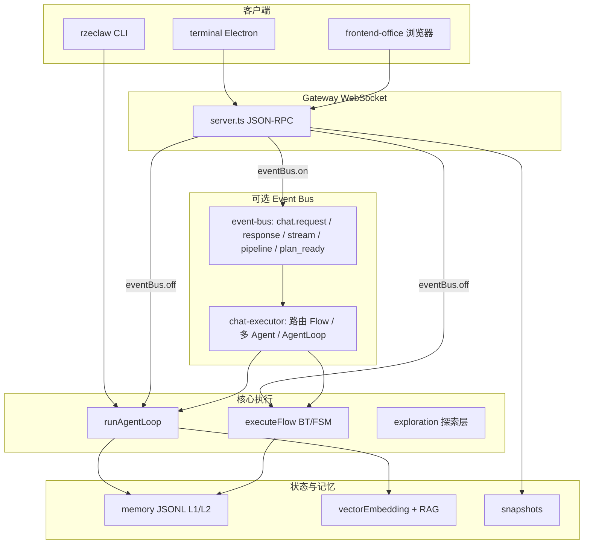

# Rzeclaw 已实现系统总设计（As-Built）

本文档描述 **当前代码库中已落地** 的架构、数据流、接口与模块边界，作为单一入口的「总设计」视图。愿景与规划类内容见 `SWARM_VISION_AND_OVERALL_DESIGN.md`、`MASTER_IMPLEMENTATION_PLAN_AND_PHASES.md`；分阶段工单与状态见 `IMPLEMENTATION_SUMMARY.md`、`PHASE7_PHASE8_IMPLEMENTATION_STATUS.md`、`PHASE16_IMPLEMENTATION_STATUS.md` 等。**字段级配置**以 `CONFIG_REFERENCE.md` 与 `src/config.ts` 为准。

---

## 1. 文档定位

| 需求 | 对应文档 |
|------|-----------|
| 产品愿景与能力支柱 | `SWARM_VISION_AND_OVERALL_DESIGN.md` |
| Phase 划分与工单索引 | `MASTER_IMPLEMENTATION_PLAN_AND_PHASES.md` |
| Phase 0～6 工单与文件映射（摘要） | `IMPLEMENTATION_SUMMARY.md` |
| **与源码一致的总体结构、路径差异、RPC/CLI 全集** | **本文档** |
| `rzeclaw.json` 字段说明 | `CONFIG_REFERENCE.md` |

---

## 2. 系统定位

Rzeclaw 是基于 OpenClaw 思路裁剪并扩展的 **本地 Node.js 智能助手**：以 **Gateway（WebSocket 控制面）** 与 **Agent 循环（多轮 LLM + 工具）** 为核心，叠加 **长期记忆、流程库（行为树/状态机）、RAG、复盘、探索层、多 Agent（Event Bus 路径）、Electron 终端与办公室前端** 等能力。

- **运行时**：Node ≥ 18，TypeScript 编译输出在 `dist/`（`npm run build`）。
- **主包入口**：`rzeclaw.mjs` → `dist/cli.js`（`package.json` 中 `bin.rzeclaw`）。

---

## 3. 仓库拓扑（实现相关）

```
Rzeclaw/
├── src/                    # 主服务与 Agent 实现（TypeScript）
│   ├── index.ts            # 加载 dotenv，启动 CLI
│   ├── cli.ts              # 子命令
│   ├── config.ts           # 配置类型、加载、热重载辅助、LLM/Gateway Key 就绪判断
│   ├── agent/              # runAgentLoop、context、goal、planning
│   ├── gateway/            # WebSocket 服务、chat 编排、chat-executor（Event Bus 执行层）
│   ├── tools/              # 核心工具、合并、IDE UI、replay_ops
│   ├── llm/                # Anthropic / DeepSeek / MiniMax / Ollama 统一客户端
│   ├── memory/             # JSONL 存储、L1/L2、检索、写入管线、冷归档、隐私隔离、滚动账本与折叠
│   ├── flows/              # 流程库、路由、BT/FSM 执行、CRUD、失败替换、LLM 生成 flow、进化插入树
│   ├── event-bus/          # 进程内总线、协作 schema
│   ├── collaboration/      # 流水线阶段、委派、蜂群广播
│   ├── agents/             # 蓝图、实例、与 flows/router 联动（主要在 Event Bus 执行路径）
│   ├── exploration/        # 探索层 Gatekeeper / Planner / Critic / 编译 / 经验
│   ├── rag/                # 向量检索、动机 RAG、flow 内外源集合
│   ├── local-model/        # 本地意图分类（Ollama / OpenAI-compatible）
│   ├── knowledge/          # 知识库摄取
│   ├── retrospective/      # 复盘、早报、pending、遥测
│   ├── heartbeat/          # Orient / Check / Act / Record
│   ├── proactive/          # 主动提议、画布与 tasks 同步
│   ├── canvas/             # current.json 画布
│   ├── skills/ / mcp/      # 本地 Skill、MCP 工具合并
│   ├── security/           # 危险命令、权限域、脱敏等
│   ├── observability/      # 日志、指标、ops.log
│   ├── diagnostic/         # 诊断报告与建议文件
│   ├── session/            # 快照
│   ├── evolution/          # Bootstrap 文档、prompt 建议
│   └── prompts/            # system prompt 拼装
├── terminal/               # Electron 客户端（连接 Gateway）
├── frontend-office/        # Phase 15：Phaser 办公室 + 对话（静态页 + WS）
├── test/                   # Node 内置 test（*.test.js）
├── scripts/                # 安装/验收脚本
├── docs/                   # 设计与状态文档（本文档位于此）
├── rzeclaw.example.json    # 配置样例
└── package.json
```

---

## 4. 架构分层（已实现）



---

## 5. 配置

- **加载顺序**：`findConfigPath()` 依次尝试 `cwd/rzeclaw.json`、`cwd/.rzeclaw.json`、`~/.rzeclaw/config.json`（Windows 下用户目录用 `USERPROFILE`）。
- **类型定义**：`RzeclawConfig` 及子配置均在 `src/config.ts`。
- **热重载**：`hotReload.intervalSeconds >= 10` 时轮询配置文件 mtime；`config.reload` RPC 可显式重载（受 `allowExplicitReload` 约束）。
- **多模型**：顶层 `model` / `apiKeyEnv` 与可选 `llm: { provider, model, apiKeyEnv, baseURL, fallbackProvider }` 合并使用；`getLLMClient` 统一解析。

---

## 6. CLI 命令（`src/cli.ts`）

| 命令 | 作用 |
|------|------|
| `gateway` | 启动 WebSocket Gateway（`-p` 覆盖端口） |
| `agent [message]` | 进程内 Agent（`-m` / `--restore` / `--privacy`） |
| `archive-cold` | 按 `memory.coldAfterDays` 冷归档 L1 |
| `audit-export` | 审计查询导出 JSON/CSV，`--summary` 汇总 |
| `metrics-export` | 会话指标 JSON |
| `diagnostic-report` | 生成诊断报告与建议文件 |
| `health` | 工作区可写 + LLM 就绪 |
| `setup` | 配置向导 |
| `self-check` / `repair` | 环境自检与修复 |
| `uninstall` | 移除依赖/构建产物，可选移除配置与数据 |

---

## 7. Gateway WebSocket 协议

- **帧格式**：JSON，含 `id`、`method`、`params`；响应带相同 `id` 与 `result` 或 `error`。
- **流式**：`chat` 处理中通过 `{ id, stream: "text", chunk }` 推送增量。
- **认证**：`gateway.auth.enabled` 时，首条请求的 `params.apiKey` 须与环境变量 `apiKeyEnv`（默认 `RZECLAW_GATEWAY_API_KEY`）一致；通过后该连接记入 `WeakMap`，后续请求不再要求。

### 7.1 已实现 RPC 方法（`src/gateway/server.ts`）

| method | 说明 |
|--------|------|
| `session.getOrCreate` | 创建/获取会话，可带 `sessionType` |
| `session.restore` | 从快照恢复 |
| `session.saveSnapshot` | 保存快照 |
| `session.list` | 列出快照元数据，支持 `workspace`、`limit` |
| `scope.grantSession` | 会话级权限域授权（写入 `grantedScopes`） |
| `health` | 健康检查 |
| `agents.list` | 多 Agent 实例列表（办公室 UI） |
| `agents.blueprints` | 蓝图列表 |
| `office.status` | `idle` / `executing`（基于本连接是否有进行中 chat） |
| `memory.yesterdaySummary` | 昨日小记（滚动账本/摘要文件） |
| `memory.fold` | 触发记忆折叠（指定日期等参数） |
| `task.getResult` / `task.listBySession` | Event Bus 异步任务结果（`taskResults.retentionMinutes`） |
| `config.reload` | 热重载配置 |
| `chat` | 主对话入口（见第 8 节） |
| `tools.call` / `tools.list` | 直接调工具 / 列出合并后工具 |
| `canvas.get` / `canvas.update` | 画布读写 |
| `proactive.suggest` | 主动提议 |
| `heartbeat.tick` | 手动心跳一拍 |
| `swarm.getTeams` | 蜂群团队列表 |
| `knowledge.ingest` | 知识库摄取 |
| `diagnostic.report` | 诊断报告 |
| `evolution.confirm` / `evolution.apply` | 进化插入树确认与应用 |
| `rag.reindex` | RAG 重索引 |
| `flows.scanFailureReplacement` | 失败替换扫描 |
| `retrospective.run` / `report` / `list` / `apply` | 复盘流水线 |

未知方法返回 `Unknown method: ...`。

### 7.2 Gateway 启动副作用

- **Heartbeat**：`heartbeat.intervalMinutes > 0` 时 `setInterval` 调用 `runHeartbeatTick`。
- **mDNS**：`gateway.discovery.enabled` 时用 `bonjour` 发布 `_rzeclaw._tcp`。
- **知识库**：`knowledge.ingestOnStart` 且配置了 `ingestPaths` 时异步 `ingestPaths`。
- **诊断定时**：`diagnostic.intervalDaysSchedule > 0` 时按天生成报告。
- **配置轮询**：与 `hotReload` 相关；`memory.rollingLedger.foldCron` 解析后触发每日折叠（实现为简化 cron：分/时两段）。

---

## 8. Chat 请求路径（关键行为差异）

### 8.1 `eventBus.enabled === false`（默认直连路径）

实现在 `server.ts` 的 `chat` 分支：

1. **L0 摘要**：按 `summaryEveryRounds` 周期性 `generateL0Summary` 更新 `session.sessionSummary`。
2. **流程匹配**（仅当 `flows.enabled` 且配置了 `routes` 与 `libraryPath`）  
   - 动机 RAG：`vectorEmbedding.collections.motivation` 命中且分数达 `motivationThreshold`，可得到 `ROUTE_TO_LOCAL_FLOW`。  
   - 否则 `matchFlow`（规则路由 + slotRules）。  
   - 再否则 **本地意图分类** `localModel.modes.intentClassifier` + `callIntentClassifier`。  
3. **会话 FSM 占位**：`sessionState` 在 `Local_Intercept` / `Executing_Task` / `Deep_Reasoning` / `Idle` 间更新（用于观测与探索层上下文）。  
4. **LLM 生成 Flow**：无匹配且 `shouldTryLLMGenerateFlow` 时，可 `runLLMGenerateFlow` 写库并返回 `generatedFlowId` / `suggestedRoute`。  
5. **命中 Flow**：`executeFlow`，带合并工具 + `write_slot`，BT/FSM 内 LLM 节点可接 `getRagContextForFlow`；结束后 `appendOutcome`、`updateFlowMetaAfterRun`、`performFailureReplacementAfterRun`、可选进化插入树、flush L1 / 滚动账本 / 冷归档等。  
6. **未命中 Flow**：若 LLM 未就绪则返回说明字符串；否则  
   - **探索层**（`exploration.enabled` 且未 skip）：`shouldEnterExploration` → `tryExploration`，可能直接 `fallbackContent` 返回，或将 `compiledMessage` 作为新的 user 输入进入 Agent。  
   - **Agent**：`runAgentLoop`（注入 `rollingContext`、角色、`teamId`、黑板、`sessionGrantedScopes` 等）。  
7. **会话结束**：写快照（非隐私）、记忆写入、prompt 建议、进化建议标志等与 Flow 成功路径对称。

**重要**：此路径 **不使用** `agents.routes` / `flows/router.ts` 的 `route()` 多 Agent 蓝图路由；蓝图与 `route()` 仅在下述 Event Bus 执行层使用。

### 8.2 `eventBus.enabled === true`

1. Gateway `chat` 发布 `ChatRequestEvent`，注册 `pendingStreamByCorrelationId` 以转发 `TOPIC_CHAT_STREAM`。  
2. **探索层**（`exploration.enabled`）：独立订阅 `TOPIC_CHAT_REQUEST`，可发布 `TOPIC_PLAN_READY`（编译后事件）或直接 `TOPIC_CHAT_RESPONSE`；执行层订阅 `TOPIC_PLAN_READY` 再进入 `handleChatRequest`。  
3. 否则单订阅 `TOPIC_CHAT_REQUEST` → `handleChatRequest`（`chat-executor.ts`）。  
4. `handleChatRequest` 内：若 `hasAgentsEnabled(config)` 且存在 `flowLibrary`，调用 **`route(message, { config, flowLibrary, successRates })`**：  
   - 可解析出 **agentId**、**flowId**，维护 **Agent 实例**（`agents/instances.ts`），按蓝图过滤工具、覆盖 LLM、局部记忆 scope（`getAgentMemoryWorkspaceId`）等。  
   - 支持 **委派** `requestDelegation`、**蜂群广播** `requestSwarmBroadcast`、流水线 **pipelineNextAgentId**（经 `TOPIC_PIPELINE_STAGE_DONE` 串联）。  
5. 任务结果写入 `task-results/store.ts`，供 `task.getResult` 查询。

---

## 9. Agent 循环 `runAgentLoop`（`src/agent/loop.ts`）

**输入要点**：`userMessage`、`sessionMessages`、`sessionGoal` / `sessionSummary` / `rollingContext`、`sessionType` / `teamId`、`sessionFlags.privacy`、`blackboard`、`sessionGrantedScopes`、`toolsFilter`、`toolsOverride`、`localMemoryScope`、`roleFragmentOverride`、`agentId` / `blueprintId`。

**主要步骤（概念顺序）**：

1. 合并工具：`getMergedTools` 或 `toolsOverride`；按 `toolsFilter`、**隐私策略** `privacySessionToolPolicy` 过滤；注入 **`write_slot`**（当传入 `blackboard` 时）。  
2. System：`buildSystemPrompt` + 角色片段（`getRoleFragment` 或覆盖）+ Bootstrap 文档 + 规划步骤（若启用）+ 记忆块（`retrieve` + `formatAsCitedBlocks` + `MEMORY_SYSTEM_INSTRUCTION`）+ Canvas 同步逻辑等。  
3. 多轮调用 LLM；工具执行前 **`validateToolArgs`**，**危险命令**、**权限域**（`permission-scopes`）、**IDE 确认策略** 等。  
4. 工具超时：`ideOperation.timeoutMs` 与单工具 timeout 的 `runToolWithTimeout`。  
5. 反思间隔：`reflectionToolCallInterval` 插入反思 user 消息。  
6. 规划模式：复杂请求 `fetchPlanSteps`，Canvas `updateCanvas` / `syncCanvasToTasks`。  
7. 返回：`content`、完整 `messages`、`sessionId`、`citedMemoryIds`。

---

## 10. 工具体系（`getMergedTools`）

固定顺序（概念上）：**CORE_TOOLS** → **Skills**（白名单目录）→ **evolved_skills**（`evolution.insertTree.enabled`）→ **MCP** → **IDE 工具**（仅 Windows：`ideOperation.uiAutomation` → `ui_describe` / `ui_act` / `ui_focus`；`keyMouse` → 键鼠类）→ **`replay_ops`**（依赖前面列表动态生成）。

**CORE_TOOLS**（`src/tools/index.ts`）：`bash`、`read`、`write`、`edit`、`process`、`env_summary`、`undo_last`、`operation_status`。

**其他模块内工具**：异步 bash、压缩等在各工具文件内实现；Gateway `tools.call` 使用与 Agent 相同的合并列表。

---

## 11. 流程库 Flows（Phase 13+）

- **库路径**：`flows.libraryPath`（相对 workspace），JSON 定义 BT / FSM。  
- **引擎**：`engine-bt.ts`、`engine-fsm.ts`；**路由**：`router.ts` 的 `matchFlow`（hint + slotRules）；**执行**：`executor.ts`。  
- **结果与学习**：`outcomes.jsonl`、`meta` 更新、`failure-replacement`、`topology-iterate`。  
- **进化插入树**：`evolution-insert-tree.ts`，与 `evolution.apply` / `evolution.confirm` 及 chat 返回中 `evolutionSuggestion` 联动。  
- **LLM 生成**：`flow-from-llm.ts` 等，`generateFlow` 配置控制触发条件。

---

## 12. 记忆系统

| 层级 | 实现要点 |
|------|-----------|
| **L0** | `context.ts` 窗口轮次；可选 `summaryEveryRounds` 生成 `sessionSummary` |
| **L1** | `store-jsonl.ts` 热文件；`write-pipeline.ts` flush；`retrieve.ts` 检索与引用格式化；`task-hint`；**脱敏** `sanitizeForMemory` |
| **L2** | `l2.ts` promote；去重与 `validity` |
| **冷存储** | `cold-archive.ts`；检索可选 `includeCold` |
| **审计** | `audit.ts` / `audit-query.ts` |
| **隐私** | `privacy-isolation.ts`；`--privacy` 与 `sessionFlags.privacy`；独立 store 与保留天数清理 |
| **Phase 17 滚动账本** | `rolling-ledger.ts`、`today-buffer.ts`、`fold.ts`；配置 `memory.rollingLedger`；`getRollingContextForPrompt` 注入 Agent；`memory.fold` RPC；`includePendingInReport` 与复盘早报联动 |

---

## 13. RAG 与知识库

- **vectorEmbedding**：Ollama 或 OpenAI-compatible 嵌入；索引目录默认在 workspace 下 `.rzeclaw/embeddings`；多 `collections` 配置。  
- **rag/index.ts**：`search`、`getRagContextForFlow`、`reindexCollection` 等；**动机 RAG** 与 `rag/motivation.ts` 维护。  
- **knowledge**：`knowledge/ingest.ts` 将文档切块写入 L1（`document` 类型）；Gateway `knowledge.ingest` 与 `ingestOnStart`。

---

## 14. 复盘与遥测

- **retrospective**：`retrospective/index.ts` — `run`、`getMorningReport`、`listPendingDates`、`applyPending`；与折叠 pending、`mergeRollingLedgerPendingIntoReport` 等协作。  
- **telemetry**：`retrospective/telemetry.js` — `flow_end`、`agent_turn`、`exploration_outcome` 等事件追加 JSONL。  
- **diagnostic**：`diagnostic/report.ts` 聚合会话与记忆指标，生成报告与 `self_improvement_suggestions.md`。

---

## 15. 探索层 Exploration（Phase 16）

- **入口**：直连 chat 中未匹配 flow 时；Event Bus 模式下订阅 `chat.request` 的前置层。  
- **模块**：`gatekeeper`、`planner`、`critic`、`compile`、`snapshot`、`experience`（JSONL 经验、outcome 回写）。  
- **配置**：`ExplorationConfig`（`timeoutMs`、`trigger`、`planner`、`critic`、`snapshot`、`experience`）。  
- **详情**：`PHASE16_IMPLEMENTATION_STATUS.md`、`EXPLORATION_PLANNER_DESIGN.md`。

---

## 16. Event Bus 与协作

- **主题**：`event-bus/index.ts` — `TOPIC_CHAT_REQUEST`、`TOPIC_CHAT_RESPONSE`、`TOPIC_CHAT_STREAM`、`TOPIC_PIPELINE_STAGE_DONE`、`TOPIC_PLAN_READY` 等。  
- **协作**：`collaboration/pipeline-runner.ts`、`delegate.ts`、`swarm.ts` 与 `collaboration-schema.ts`。  
- **任务结果**：`task-results/store.ts` + Gateway `task.*`。

---

## 17. 多 Agent（蓝图）

- **配置**：`agents.blueprints`、`agents.routes`、`agents.defaultAgentId`。  
- **运行时**：**仅在 `eventBus.enabled` 且 `handleChatRequest` 路径** 中，通过 `flows/router.ts` 的 `route()` 与蓝图绑定 flow、工具子集、局部记忆、LLM 覆盖。  
- **实例状态**：`agents/instances.ts`，供 `agents.list` 与办公室前端展示。

---

## 18. 安全与隐私（摘要）

- **危险命令**：`security/dangerous-commands.ts`，模式 `block | confirm | dryRunOnly`。  
- **进程终止**：`processKillRequireConfirm`、`protectedPids`。  
- **权限域**：`permission-scopes.ts` + `scope.grantSession` + 计划内定时授权 `scheduledGrants`。  
- **隐私会话**：工具白名单/只读/禁用、`opsLogPrivacySessionPolicy`、隔离存储与保留天数。  
- **事后回顾**：`postActionReview` 配置项。  
- **详细设计**：`SECURITY_AND_PRIVACY_DESIGN.md` 等（实现以代码为准）。

---

## 19. LLM 提供商

`src/llm/`：`anthropic`、`deepseek`、`minimax`、`ollama`；统一类型 `LLMMessage`、流式与非流式调用在 `loop` 与 `singleTurnLLM` 等场景使用。

---

## 20. 客户端

### 20.1 Terminal（`terminal/`）

Electron：WebSocket JSON-RPC、流式 chat、会话列表/恢复、画布读写、proactive、heartbeat、tools.list、多连接配置（见 `PHASE7_PHASE8_IMPLEMENTATION_STATUS.md`）、Gateway 发现扫描等。

### 20.2 frontend-office（`frontend-office/`）

静态页面 + Phaser：`gateway.js` WebSocket，`game.js` 场景与 Agent 占位，`layout.js` 布局；依赖 Gateway `office.status`、`agents.list`、`chat` 流式、`agents.blueprints`、可选 `memory.yesterdaySummary`。说明见 `frontend-office/README.md`。

---

## 21. 工作区磁盘布局（约定）

在 `workspace` 下 `.rzeclaw/` 常见包含：

- `memory/` — 热/冷 JSONL、滚动账本、今日缓冲、隐私隔离目录  
- `snapshots/` — 会话快照 JSON  
- `session_summaries/` — 会话摘要 md  
- `audit.jsonl` — 记忆审计  
- `canvas/current.json` — 画布  
- `flows/` — 流程库 JSON  
- `skills/`、`evolved_skills/` — Skill  
- `embeddings/` — 向量索引  
- `diagnostics/` — 诊断报告  
- `exploration/` — 探索经验等  
- `prompt_suggestions.md`、`self_improvement_suggestions.md` 等

精确路径与文件名以各模块实现为准。

---

## 22. 测试与构建

- `npm run build` — `tsc`  
- `npm test` — `npm run build && node --test test/*.test.js`  
- 验收脚本：`scripts/acceptance-check.mjs`、`scripts/acceptance.md`

---

## 23. 维护建议

1. **改行为**时同步更新本文档中与该行为相关的章节（尤其第 8 节两条 chat 路径的差异）。  
2. **新增 Gateway 方法**时更新第 7.1 节表与 `USAGE_AND_VERIFICATION.md`（若存在对应验收项）。  
3. **配置项**以 `CONFIG_REFERENCE.md` 为单一详解来源，本文档只保留索引与架构级说明。

---

*文档版本：与仓库 As-Built 同步编写；若发现与代码不一致，以 `src/` 为准并应修订本文档。*
